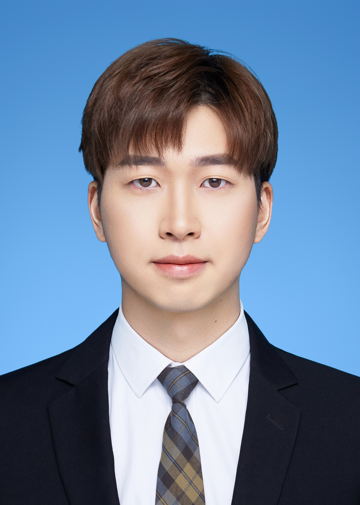

# About Me

Here is **Yi Zuo (左谊)**.

I am a second-year master's student majoring in **Computer Science and Technology** from the School of Artificial Intelligence at [Xidian University](https://www.xidian.edu.cn/). Currently, I am working in the **IPIU Lab** (the Key Laboratory of Intelligent Perception and Image Understanding of the Ministry of Education of China). Here is [[my resume](./file/zuoyi-2022master-cv.pdf)].

 

## Academic Background

**[Highlight] I am looking for a doctoral degree starting in the autumn of 2025. If you are interested in me, please contact me!**

I will reply to any emails related to PhD, if you have not received my reply. Please try my other email: yzuo_1@stu.xidian.edu.cn.

- **Sep 2018 - June 2022:** Xidian University (School of Economics and Management-Electronic Commerce).
- **Sep 2022 - June 2025:** Xidian University (School of Artificial Intelligence-Computer Science and Technology), supervised by [Prof. Cheng Jiao Li](https://scholar.google.com/citations?user=FZbrL2YAAAAJ&hl=en)

 

---

## Research Interests

- Video Editing
- Video Generation
- Change Detection in Remote Sensing

My current research focus is on **computer vision**. I hope to dedicate my talents to this meaningful cause and bring happiness to society.

 

---

## News and Updates(some key)

- **Mar 2024：**A TGRS paper is accepted. [Robust Instance-based Semi-supervised Learning Change Detection for Remote Sensing Image](https://ieeexplore.ieee.org/abstract/document/10475371)
- **Oct 2023：**Reported in ICCV2023 [workshop](https://uncv2023.github.io/).
- **Sep 2023：**ICCV2023 [UNCV2023 MUAD Uncertainty Estimation for Semantic Segmentation Challenge](https://uncv2023.github.io/)  Champion.
- **Sep 2023：**ICCV2023 [The 5th Large-scale Video Object Segmentation Challenge Track1](https://youtube-vos.org/challenge/2023/) Champion.
- **July 2023：**Responsible for the eye-controlled intelligent wheelchair project.
- **May-June 2023：**Awarded on CVPR2023 [UG^2+ Track2](http://cvpr2023.ug2challenge.org/track2.html), [Epic-Kitchens Challenge](https://epic-kitchens.github.io/2023), [Epic-Kitchens Challenge](https://epic-kitchens.github.io/2023)
- **Sep 2022：**ECCV2022 [AIM 2022 Instagram Filter Removal Challenge](https://data.vision.ee.ethz.ch/cvl/aim22/) Champion.
- **Sep 2022：**Master's student at Xidian University.
<!-- - **July 2022：**Responsible for the Apollo intelligent unmanned vehicle. -->
- **June 2022：**Graduated from Xidian University with a degree in Management.
- **Jan 2022：**Received the SenseTime Future Star Award of 2021 Year (20 people each year).
- **Sep 2021：**SenseTime Internship for 9 months. From project proposal to improvement, deeply participate in CareNurse projects. Here are some related news reports: [New 1](https://baijiahao.baidu.com/s?id=1764316686058681537&wfr=spider&for=pc), [New 2](https://baijiahao.baidu.com/s?id=1736230330595373751&wfr=spider&for=pc), [New 3](https://www.thepaper.cn/newsDetail_forward_18668369), [New 4](https://baijiahao.baidu.com/s?id=1736218627222506189&wfr=spider&for=pc), [New 5](http://www.cb.com.cn/index/show/gszx/cv/cv135284262276).
- **May 2021：**Participated in the [Robomaster](https://www.robomaster.com/zh-CN), responsible for visual algorithms.
<!-- - If you are interested in my works, please feel free to book an [[online talk with me](https://calendly.com/lancecai/meet-with-lance)]. -->

---

## WeChat
